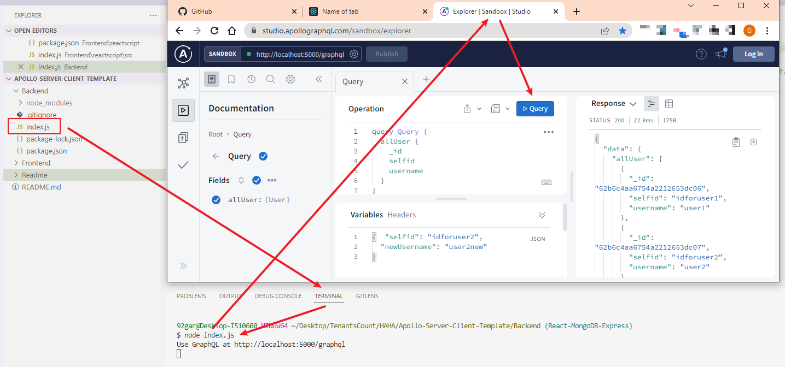
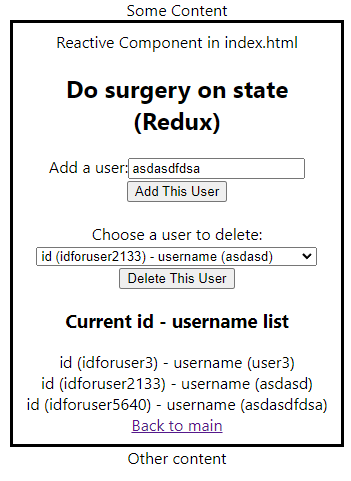
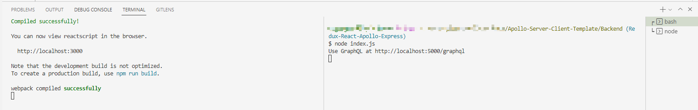

# FamilyCookbook
This is a easi app for everyone to decide on what to cook and prepare for next meal

## Table of Contents

  ***

  * [Backend](#backend)
  * [Backend-Screenshot](#backend-screenshot)
  * [Frontend](#frontend)
  * [Frontend-Screenshot](#frontend-screenshot)
  * [Full-Installation](#installation)
  * [Guidebook](#guidebook)
  * [License](#license)
  * [Contributing](#contributing)
  * [Questions](#questions)

  ***

  ##  Backend
  ### Backend-Screenshot

  [Check out the content](https://github.com/Hongnodie/Apollo-Server-Client-Template/tree/React-MongoDB-Express)

  <p align="center">
    
  </p>
  
  [See basic apollo code package at Github](https://github.com/Hongnodie/Apollo-Server-Client-Template.git)

  ##  Frontend
  ### Frontend-Screenshot

  <p align="center">
    
  </p>

  ### Installation

  This app need both frontend and backend running in ternimal to funtion properly, the screenshot is provided below:

  <p align="center">
    
  </p>

  <strong> As for Backend </strong><br>

  All necessary code are in a single file: "Backend" Folder "index.js" file [Go to index.js(Backend)](https://github.com/Hongnodie/Apollo-Server-Client-Template/blob/Redux-React-Apollo-Express/Backend/index.js)

  All commands to run for backend (in the terminal) (or alias "Shell") are summed up here
  ```
  npm install graphql mongoose express apollo-server-express
  node index.js
  ```

  <strong> As for Frontend </strong><br>

  All necessary code displayed in two forms: built-in index or export default to index.js [Go to frontend folder](https://github.com/Hongnodie/Apollo-Server-Client-Template/tree/Redux-React-Apollo-Express/Frontend/reactscript)

  All commands to run for frontend (in the terminal) (or alias "Shell") are summed up here (terminal direct to the index.js in frontend folder i.e. /Frontend/reactscript/src)
  ```
  npm install react react-dom react-router-dom @apollo/client react-scripts react-redux @reduxjs/toolkit 
  npm start
  ```

  (This should take around 2 minutes to start and automatically open the browser on my desktop)
  ### Guidebook

  <details>
  <summary>All included documentation</summary>
  <br>

  Check out package difference-(https://www.apollographql.com/docs/apollo-server/integrations/middleware)

  Apollo Server Express Quick Start-(https://www.apollographql.com/docs/apollo-server/integrations/middleware#apollo-server-express) - Switch from "apollo server" to "apollo-server-express"

  MongoDB Server-(https://cloud.mongodb.com/) - This is where data are saved and checked

  Mongoose npm package-(https://mongoosejs.com/docs/index.html) - the tool to utilize mongoDB cloud server

  Quick start for express-(http://expressjs.com/en/starter/hello-world.html) - All basic component you need to know are well confined here

  </details>

  <details>
  <summary>Some deprecation warning solution</summary>
  <br>

  ```
  (node:6492) [DEP_WEBPACK_DEV_SERVER_ON_AFTER_SETUP_MIDDLEWARE] DeprecationWarning: 'onAfterSetupMiddleware' option is deprecated. Please use the 'setupMiddlewares' option.
  (Use `node --trace-deprecation ...` to show where the warning was created)
  (node:6492) [DEP_WEBPACK_DEV_SERVER_ON_BEFORE_SETUP_MIDDLEWARE] DeprecationWarning: 'onBeforeSetupMiddleware' option is deprecated. Please use the 'setupMiddlewares' option.
  ```

  </details>

  <details>
  <summary>Readme edit guide</summary>
  <br>

  Component sample list-(https://github.com/tchapi/markdown-cheatsheet/blob/master/README.md)

  </details>

  <details>
  <summary>Package Size Elimination</summary>
  <br>
  Node_modules of Frontend

  Npm cache (150MB) - Check why it's so big here(https://stackoverflow.com/questions/64234215/node-modules-size)

  @jest (3MB) - If not testing, just uninstall it (https://jestjs.io/docs/getting-started)

  ajv (5MB) - JSON validator for node.js (https://www.npmjs.com/package/ajv)
  
  </details>
  
  ### License
  <details>
  
  <summary>MIT License</summary>
  <br>

  Copyright (c) [2022] [Hongnodie]
  > 
  > __Permission is hereby granted, free of charge, to any person obtaining a copy__
  > __of this software and associated documentation files (the "Software"), to deal__
  > __in the Software without restriction, including without limitation the rights__
  > __to use, copy, modify, merge, publish, distribute, sublicense, and/or sell__
  > __copies of the Software, and to permit persons to whom the Software is__
  > __furnished to do so, subject to the following conditions:__
  > 
  > The above copyright notice and this permission notice shall be included in all
  > copies or substantial portions of the Software.
  > 
  > THE SOFTWARE IS PROVIDED "AS IS", WITHOUT WARRANTY OF ANY KIND, EXPRESS OR
  > IMPLIED, INCLUDING BUT NOT LIMITED TO THE WARRANTIES OF MERCHANTABILITY,
  > FITNESS FOR A PARTICULAR PURPOSE AND NONINFRINGEMENT. IN NO EVENT SHALL THE
  > AUTHORS OR COPYRIGHT HOLDERS BE LIABLE FOR ANY CLAIM, DAMAGES OR OTHER
  > LIABILITY, WHETHER IN AN ACTION OF CONTRACT, TORT OR OTHERWISE, ARISING FROM,
  > OUT OF OR IN CONNECTION WITH THE SOFTWARE OR THE USE OR OTHER DEALINGS IN THE
  > SOFTWARE.    
  </details>

  ### Contributing

  This is built by Hongnodie. 
  
  ### Questions?

  If you have any questions about the project you can reach out to me via email or GitHub with the information below. 

  >Email  : 92ganhong@gmail.com 

  >GitHub : [Hongnodie](https://github.com/Hongnodie)